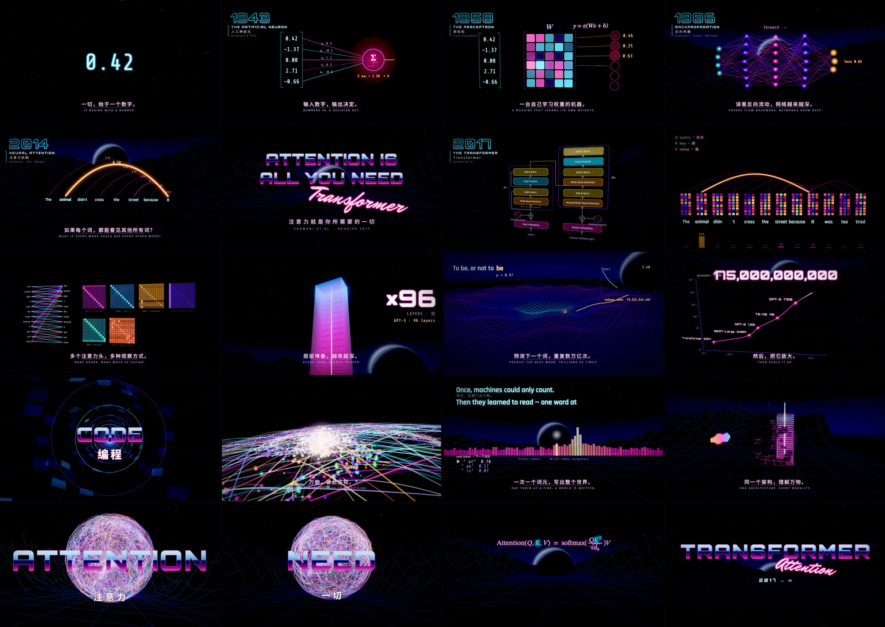

# ATTENTION — 一部关于 Transformer 的合成器浪潮宣传片

> 从一个数字开始，经过神经元、感知机、反向传播、LSTM，走到注意力机制与 Transformer，
> 最后在副歌高潮里展开“注意力星系”、逐词生成、多模态统一 —— 再回到那条公式。

一部完全由代码生成的 3 分 56 秒宣传片：Three.js 实时渲染，每一帧都是“歌曲时间”的纯函数，
画面的段落、转场和脉冲都卡在 **Lazer Boomerang《Hong Kong Story》**（80 BPM）的小节与鼓点上。



- 🎵 音乐：[Hong Kong Story — Lazer Boomerang (Spotify)](https://open.spotify.com/track/3egnvac0kettJ7Er5x7u0W)
- 🎞 两种观看方式：浏览器实时播放（可载入音乐、可录制），或离线渲染成 MP4（自动对齐并混入音乐）

**音乐不包含在仓库里**（版权原因）。请使用你自己合法获得的音频文件；程序会自动分析并对齐。

---

## 快速开始

```bash
npm install
npm run dev          # 打开终端里显示的地址（默认 http://localhost:5173）
```

1. 点 **「♪ 载入音乐文件」**（或直接把 mp3 / m4a / flac / wav 拖进窗口）。
   程序会解码音频、检测鼓点，并把它与这首歌的响度轮廓做互相关，自动求出对齐偏移（前面多几秒静音也没关系）。
2. 自动开始播放。快捷键：`空格` 播放/暂停，`←/→` 跳一小节（`Shift` 跳四小节），`F` 全屏。
3. 想要带音乐的视频：点 **● REC**，从头播放并录制，结束后自动下载 `.webm`（请保持标签页在前台）。
4. 没有音乐也能直接点「直接播放」：画面会按歌曲的结构与 80 BPM 的虚拟鼓点律动。

### 离线渲染 MP4（逐帧、确定性、可并行）

```bash
# 1080p30，带音乐（音频会被分析、对齐并混入）
npm run render -- --audio audio/hong-kong-story.mp3

# 其他示例
npm run render -- --w 1280 --workers 3                     # 720p 无声预览
npm run render -- --audio audio/song.mp3 --w 3840 --fps 60  # 4K60
npm run render -- --from 132 --to 180 --out out/climax.mp4  # 只渲染高潮段（秒）
npm run stills -- --times 38,70,140                         # 导出单帧 PNG
npm run analyze -- audio/hong-kong-story.mp3                # 只看分析结果（BPM / 偏移 / 匹配度）
```

画面有两种风格（`src/core/theme.js`）：默认 **deep**（深蓝夜空、暗淡的网格、背光行星、克制的光晕与闪白），
以及原版霓虹合成器浪潮 **neon**。播放器地址加 `?look=neon`，或渲染时加 `--look neon` 即可切换。

渲染器用 Playwright 驱动无头 Chromium，逐帧截取画面并交给 ffmpeg（H.264）编码，最后混入音频。
默认使用 CPU 软件渲染（SwiftShader），在有显卡的机器上可加 `--angle default`（或 `vulkan` / `metal` / `gl`）大幅提速。
需要本机有 `ffmpeg`（或设置 `FFMPEG_PATH`），以及 Playwright 的 Chromium（`npx playwright install chromium`）。

---

## 音乐结构与分镜

歌曲实测：每拍 0.75 s（**80 BPM**，4/4），一小节 3 s，第 0 小节从 0:00 开始。
段落来自整首歌的响度轮廓：

| 时间 | 小节 | 音乐 | 画面 |
|---|---|---|---|
| 0:00–0:06 | 0–1 | 前奏·无鼓，渐强 | **一个数字** `0.42` 在黑暗中点亮，数字之海浮现 |
| 0:06–0:12 | 2–3 | | 数字组成向量 → 加权求和 → 神经元点火（**1943** McCulloch & Pitts） |
| 0:12–0:18 | 4–5 | | 连接折叠成权重矩阵 W，逐行计算 `y = σ(Wx+b)`（**1958** 感知机） |
| 0:18–0:24 | 6–7 | 渐强上一个台阶 | 合成器浪潮世界第一次升起；深层网络前向传播、误差反向流动（**1986** 反向传播） |
| 0:24–0:30 | 8–9 | | 词语化为向量，LSTM 一次读一个词，记忆逐渐褪色（**1997** LSTM） |
| 0:30–0:36 | 10–11 | 再上台阶 + riser | “it” 直接回看所有词、找到 “animal”（**2014** 注意力）；年份跳到 2017，白光 |
| 0:36–0:42 | 12–13 | **Drop 1** | 铬金标题 **ATTENTION IS ALL YOU NEED** + 霓虹手写 *Transformer* |
| 0:42–0:48 | 14–15 | | 论文架构图（Figure 1）逐拍点亮，镜头俯冲进 Input Embedding |
| 0:48–1:00 | 16–19 | | 句子切成 GPT-2 词元（真实 id）→ 嵌入向量升起 → 正弦位置编码叠加 |
| 1:00–1:12 | 20–23 | | Q / K / V；“it” 的查询扫过所有键，softmax 后 61% 落在 “animal”；12×12 注意力矩阵逐行填满；公式定格 |
| 1:12–1:24 | 24–27 | | 8 个注意力头逐拍亮起（BertViz 式连线），合并 → 前馈网络 → 残差 → 一个 Transformer Block |
| 1:24–1:36 | 28–31 | 中段·鼓点前置 | 每一拍堆叠更多层，直到 96 层（GPT-3 的深度）的光之塔 |
| 1:36–1:48 | 32–35 | | 霓虹损失地形上，参数每拍走一步梯度下降；“预测下一个词” |
| 1:48–2:00 | 36–39 | | 对数坐标的规模曲线：Transformer 65M → BERT 340M → GPT-2 1.5B → T5 11B → GPT-3 175B → Switch-C 1.6T |
| 2:00–2:12 | 40–43 | build-up | 注意力图铺成的超空间隧道，每拍闪现一种涌现能力，最后一小节 16 分音符抖动 → 白光 |
| 2:12–2:24 | 44–47 | **Drop 2 · 高潮** | **注意力星系**：3200 个词元恒星、1400 条注意力弧随每一拍成波爆发 |
| 2:24–2:36 | 48–51 | | 逐词生成：词表概率分布化作地平线上的霓虹均衡器，每个词元落在八分/十六分音符上 |
| 2:36–2:48 | 52–55 | | 同一个架构，理解万物：文本、图像切块（ViT）、这首歌自己的波形、代码与蛋白质序列，逐小节甩镜头汇入同一座塔 |
| 2:48–3:00 | 56–59 | | 注意力之球；每小节砸出一个词：**ATTENTION / IS ALL / YOU / NEED**；坍缩成一点 |
| 3:00–3:27 | 60–68 | 尾声·鼓点渐弱 | 夕阳下的公式 `Attention(Q,K,V) = softmax(QKᵀ/√dₖ)V`，Q、K、V、softmax、√dₖ 逐一点亮 |
| 3:27–3:56 | 69–78 | 余音·稀疏重击 | 论文与八位作者落在尾声的重击上 → TRANSFORMER 标志 → 回到最初的 `0.42`，最后一击后黑场 |

---

## 画面如何跟随音乐

- **节拍网格**：所有场景都按小节编排（`src/scenes/index.js`），1 小节 = 3 s。
- **结构**：`src/data/reference-envelope.js` 保存了整首歌的响度轮廓（1800 个点，来自 SoundCloud 公开的波形缩略图，不含任何音频），
  没有载入音乐时用它来驱动整体能量，并按编曲生成虚拟的底鼓/军鼓/镲片包络。
- **载入真实音频时**（`src/core/analyze.js`，浏览器与 Node 共用）：
  - STFT + 分频段谱通量，检测底鼓 / 军鼓 / 镲片起音，生成衰减包络；另有响度、低/中/高频电平；
  - 自相关估计速度（支持加速/放慢的版本，按比例缩放时间轴）；
  - 与参考响度轮廓互相关求粗偏移，再在节拍网格上以 5 ms 精度细调。
- 底鼓 → 网格与太阳脉冲、镜头轻推、泛光增强；军鼓 → 色散；小节强拍 → 转场、字幕、闪白。

## 项目结构

```
index.html              播放器页面（载入音乐 / 时间线 / 录制）
src/main.js             播放器与渲染模式入口（window.__mt 供离线渲染调用）
src/copy.js             所有屏幕文字（中英双语）
src/core/
  song.js               80 BPM 网格与段落
  director.js           调度场景、渲染管线（场景 → 泛光 → 调色 → HUD → CRT 质感）
  post.js               HDR 泛光（dual-filter）、PBR Neutral 色调映射、色散/扫描线/颗粒/故障
  env.js                合成器浪潮世界：天空、星空、条纹太阳、远山、滚动霓虹网格地形
  materials.js          发光线（逐线显现/脉冲）、发光粒子、热力图矩阵、柔边面板
  text.js / labels.js   Canvas 文字纹理、成千上万标签的实例化渲染
  features.js           音频特征接口（虚拟 / 实测）
  analyze.js            音频分析与对齐
src/scenes/01–21        21 个场景，每个都是时间的纯函数
tools/render.mjs        并行逐帧渲染 → MP4（+ 音频）
tools/stills.mjs        导出单帧
tools/analyze.mjs       命令行音频分析
tools/fetch-fonts.mjs   下载并裁剪字体（中文字体按实际用字子集化）
```

## 事实与出处

- McCulloch & Pitts, *A Logical Calculus of the Ideas Immanent in Nervous Activity* (1943)
- Rosenblatt, *The Perceptron* (1958)
- Rumelhart, Hinton & Williams, *Learning representations by back-propagating errors* (1986)
- Hochreiter & Schmidhuber, *Long Short-Term Memory* (1997)
- Bahdanau, Cho & Bengio, *Neural Machine Translation by Jointly Learning to Align and Translate* (2014)
- Vaswani et al., *Attention Is All You Need* (NeurIPS 2017)
- 参数量：Transformer-base 65M、BERT-Large 340M、GPT-2 1.5B、T5-11B、GPT-3 175B（96 层）、Switch-C 1.6T —— 均为论文公布数值
- 示例句子的词元 id 来自 GPT-2 BPE 词表（`tiktoken` 的 `gpt2` 编码）

## 致谢与许可

- 音乐：**“Hong Kong Story” — Lazer Boomerang**（未包含在仓库中）
- 字体：Orbitron、Rajdhani、Share Tech Mono、Mr Dafoe、STIX Two Text、Noto Sans SC —— SIL Open Font License 1.1（见 `src/assets/fonts/LICENSE.md`）
- [three.js](https://threejs.org)（MIT）
